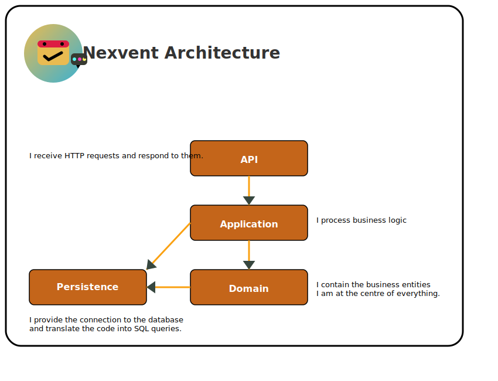

# Nexvent Architecture

The project follows a clean architecture pattern with clear separation of concerns between layers.

## Layers

- **API**  
  Handles HTTP requests and sends responses. This layer has no business logic.

- **Application**  
  Contains all use cases and business rules. Acts as the orchestrator between Domain and other layers.

- **Domain**  
  Core of the system containing entities and domain logic. This layer does not depend on any other.

- **Persistence**  
  Manages database connections and query translations. Implements repository patterns.

## Flow

1. The **API** receives the request.
2. The **Application** layer processes the business logic.
3. The **Domain** layer defines and enforces core business rules.
4. The **Persistence** layer provides data access and communicates with the database.

## Diagram

